# AI Agent 빌드/배포를 위한 Agentic AI Ops/Pipeline 구축 가이드

## 목차
1. [개요](#개요)
2. [준비사항](#준비사항)
3. [파이프라인 아키텍처](#파이프라인-아키텍처)
4. [구성 요소별 상세](#구성-요소별-상세)
5. [구현 단계](#구현-단계)
6. [체크리스트](#체크리스트)

---

## 개요

AI Agent의 빌드 및 배포는 전통적인 애플리케이션과 달리 **프롬프트, Knowledge Base, 모델 버전, 테스트 시나리오** 등 특수한 구성 요소를 관리해야 합니다. 이 문서는 AI Agent 전용 CI/CD 파이프라인 구축을 위한 가이드를 제공합니다.

### 주요 특징
- **프롬프트 버전 관리**: 프롬프트 템플릿의 버전 관리 및 롤백
- **Knowledge Base 관리**: 벡터 인덱스 업데이트 및 동기화
- **Agent 정의 관리**: Agent 스키마, 도구 정의, 권한 설정
- **자동화된 테스트**: 단위 테스트, 통합 테스트, A/B 테스트
- **평가 및 검증**: 자동화된 평가 파이프라인
- **단계별 배포**: Dev → Staging → Production

---

## 준비사항

### 1. 저장소 구조 설계

#### 1.1 Git 저장소 구조
```
agent-project/
├── agents/                    # Agent 정의
│   ├── {agent-name}/
│   │   ├── agent-definition.yaml    # Agent 스키마 정의
│   │   ├── prompts/                 # 프롬프트 템플릿
│   │   │   ├── system-prompt.md
│   │   │   ├── user-prompt-template.md
│   │   │   └── versions/            # 프롬프트 버전 관리
│   │   ├── tools/                   # 도구 정의
│   │   │   ├── tool-definitions.yaml
│   │   │   └── implementations/     # 도구 구현 코드
│   │   ├── knowledge-base/          # Knowledge Base 설정
│   │   │   ├── data-sources.yaml
│   │   │   └── embedding-config.yaml
│   │   └── tests/                   # 테스트 시나리오
│   │       ├── unit-tests.yaml
│   │       ├── integration-tests.yaml
│   │       └── evaluation-dataset.json
├── infrastructure/            # 인프라 코드
│   ├── terraform/             # 또는 CloudFormation, Bicep
│   ├── kubernetes/            # K8s 매니페스트
│   └── scripts/               # 배포 스크립트
├── pipelines/                 # CI/CD 파이프라인 정의
│   ├── build-pipeline.yaml
│   ├── test-pipeline.yaml
│   ├── deploy-pipeline.yaml
│   └── evaluation-pipeline.yaml
├── templates/                 # Agent 템플릿
│   ├── basic-agent-template/
│   ├── rag-agent-template/
│   └── multi-agent-template/
└── docs/                      # 문서
    ├── architecture.md
    ├── deployment-guide.md
    └── testing-guide.md
```

#### 1.2 Agent 정의 스키마 (YAML 예시)
```yaml
# agent-definition.yaml
apiVersion: agent.ai/v1
kind: Agent
metadata:
  name: customer-support-agent
  version: 1.0.0
  description: 고객 지원을 위한 AI Agent
spec:
  foundationModel:
    provider: aws  # aws, azure, gcp
    modelId: anthropic.claude-3-sonnet
    temperature: 0.7
    maxTokens: 2048
  
  prompts:
    systemPrompt: prompts/system-prompt.md
    userPromptTemplate: prompts/user-prompt-template.md
    version: v1.2.0
  
  tools:
    - name: search-knowledge-base
      type: function
      definition: tools/tool-definitions.yaml#search-kb
    - name: create-ticket
      type: api
      endpoint: https://api.example.com/tickets
      authentication: oauth2
  
  knowledgeBase:
    enabled: true
    dataSources:
      - type: s3
        bucket: agent-knowledge-base
        path: documents/
      - type: database
        connectionString: ${DB_CONNECTION_STRING}
    embeddingModel: text-embedding-ada-002
    vectorStore: opensearch
  
  security:
    guardrails:
      enabled: true
      contentFilter: moderate
      piiDetection: true
    permissions:
      - resource: "s3://agent-data/*"
        actions: ["read"]
  
  observability:
    logging:
      level: INFO
      destinations: [cloudwatch, datadog]
    metrics:
      - latency
      - tokenUsage
      - errorRate
    tracing:
      enabled: true
      provider: xray
```

### 2. 버전 관리 전략

#### 2.1 프롬프트 버전 관리
- **Semantic Versioning**: Major.Minor.Patch 형식
- **태그 기반 관리**: Git 태그로 프롬프트 버전 추적
- **변경 이력 추적**: 프롬프트 변경 시 자동 커밋 및 태그

```bash
# 프롬프트 버전 태그 예시
prompts/v1.0.0
prompts/v1.1.0
prompts/v2.0.0
```

#### 2.2 Agent 버전 관리
- **Agent 정의 버전**: agent-definition.yaml의 version 필드
- **도구 버전**: 각 도구의 독립적인 버전 관리
- **Knowledge Base 버전**: 인덱스 버전 및 데이터 소스 버전

### 3. 테스트 전략

#### 3.1 테스트 유형
1. **단위 테스트**
   - 프롬프트 렌더링 테스트
   - 도구 호출 테스트
   - 입력/출력 검증 테스트

2. **통합 테스트**
   - 전체 워크플로우 테스트
   - Knowledge Base 검색 테스트
   - 도구 실행 통합 테스트

3. **평가 테스트 (Evaluation)**
   - 정확도 평가
   - 관련성 평가
   - 응답 품질 평가
   - A/B 테스트

#### 3.2 테스트 데이터셋
```json
// evaluation-dataset.json
{
  "testCases": [
    {
      "id": "tc-001",
      "input": "고객이 제품 반품을 요청했습니다",
      "expectedOutput": {
        "intent": "return_request",
        "requiredTools": ["create-ticket", "search-knowledge-base"],
        "expectedResponse": "반품 절차에 대한 안내"
      },
      "context": {
        "userRole": "customer",
        "sessionHistory": []
      }
    }
  ],
  "evaluationMetrics": [
    "accuracy",
    "relevance",
    "completeness",
    "responseTime"
  ]
}
```

---

## 파이프라인 아키텍처

### 전체 파이프라인 흐름

```mermaid
graph LR
    subgraph "Source Control"
        Git[Git Repository]
    end
    
    subgraph "Build Stage"
        Validate[검증<br/>스키마/구문 검사]
        Build[빌드<br/>Agent 정의 생성]
        Package[패키징<br/>배포 아티팩트 생성]
    end
    
    subgraph "Test Stage"
        UnitTest[단위 테스트]
        IntegrationTest[통합 테스트]
        Evaluation[평가 테스트]
    end
    
    subgraph "Deploy Stage"
        DeployDev[Dev 환경 배포]
        DeployStaging[Staging 환경 배포]
        DeployProd[Production 환경 배포]
    end
    
    subgraph "Post-Deploy"
        Monitor[모니터링]
        Rollback[롤백]
    end
    
    Git --> Validate
    Validate --> Build
    Build --> Package
    Package --> UnitTest
    UnitTest --> IntegrationTest
    IntegrationTest --> Evaluation
    Evaluation --> DeployDev
    DeployDev --> DeployStaging
    DeployStaging --> DeployProd
    DeployProd --> Monitor
    Monitor --> Rollback
```



### 단계별 상세 파이프라인

#### 1. Build Stage
```yaml
# build-pipeline.yaml (예시: GitHub Actions)
name: Build Agent

on:
  push:
    branches: [main, develop]
  pull_request:
    branches: [main]

jobs:
  validate:
    runs-on: ubuntu-latest
    steps:
      - uses: actions/checkout@v3
      - name: Validate Agent Definition
        run: |
          # Agent 정의 스키마 검증
          python scripts/validate-agent-definition.py agents/*/agent-definition.yaml
      
      - name: Validate Prompts
        run: |
          # 프롬프트 문법 및 구조 검증
          python scripts/validate-prompts.py agents/*/prompts/
      
      - name: Check Security
        run: |
          # 보안 정책 검증
          python scripts/check-security-policies.py agents/*/

  build:
    needs: validate
    runs-on: ubuntu-latest
    steps:
      - uses: actions/checkout@v3
      - name: Build Agent Artifacts
        run: |
          # Agent 정의를 배포 가능한 형태로 변환
          python scripts/build-agent.py --agent-dir agents/customer-support-agent
      
      - name: Package Artifacts
        run: |
          # 배포 패키지 생성
          tar -czf agent-artifacts.tar.gz build/
      
      - name: Upload Artifacts
        uses: actions/upload-artifact@v3
        with:
          name: agent-artifacts
          path: agent-artifacts.tar.gz
```

#### 2. Test Stage
```yaml
# test-pipeline.yaml
jobs:
  unit-test:
    runs-on: ubuntu-latest
    steps:
      - uses: actions/checkout@v3
      - name: Run Unit Tests
        run: |
          pytest tests/unit/ -v
      
      - name: Test Prompt Rendering
        run: |
          python scripts/test-prompt-rendering.py

  integration-test:
    runs-on: ubuntu-latest
    steps:
      - uses: actions/checkout@v3
      - name: Deploy Test Environment
        run: |
          # 테스트 환경에 Agent 배포
          terraform apply -auto-approve -var="environment=test"
      
      - name: Run Integration Tests
        run: |
          pytest tests/integration/ -v
      
      - name: Cleanup Test Environment
        if: always()
        run: |
          terraform destroy -auto-approve -var="environment=test"

  evaluation:
    runs-on: ubuntu-latest
    steps:
      - uses: actions/checkout@v3
      - name: Run Evaluation
        run: |
          python scripts/run-evaluation.py \
            --dataset tests/evaluation-dataset.json \
            --agent agents/customer-support-agent
      
      - name: Generate Evaluation Report
        run: |
          python scripts/generate-evaluation-report.py
      
      - name: Upload Evaluation Results
        uses: actions/upload-artifact@v3
        with:
          name: evaluation-results
          path: evaluation-results/
```

#### 3. Deploy Stage
```yaml
# deploy-pipeline.yaml
jobs:
  deploy-dev:
    environment: development
    runs-on: ubuntu-latest
    steps:
      - uses: actions/checkout@v3
      - name: Deploy to Dev
        run: |
          python scripts/deploy-agent.py \
            --environment dev \
            --agent-definition agents/customer-support-agent/agent-definition.yaml
      
      - name: Run Smoke Tests
        run: |
          python scripts/smoke-tests.py --environment dev

  deploy-staging:
    needs: deploy-dev
    environment: staging
    runs-on: ubuntu-latest
    steps:
      - uses: actions/checkout@v3
      - name: Deploy to Staging
        run: |
          python scripts/deploy-agent.py \
            --environment staging \
            --agent-definition agents/customer-support-agent/agent-definition.yaml
      
      - name: Run Full Test Suite
        run: |
          pytest tests/ -v

  deploy-production:
    needs: deploy-staging
    environment: production
    runs-on: ubuntu-latest
    steps:
      - uses: actions/checkout@v3
      - name: Deploy to Production
        run: |
          python scripts/deploy-agent.py \
            --environment production \
            --agent-definition agents/customer-support-agent/agent-definition.yaml \
            --enable-canary
      
      - name: Monitor Deployment
        run: |
          python scripts/monitor-deployment.py --timeout 300
```

---

## 구성 요소별 상세

### 1. Agent 정의 관리

#### 1.1 Agent 정의 스키마 검증
```python
# scripts/validate-agent-definition.py
import yaml
import jsonschema
import sys

def validate_agent_definition(file_path):
    with open(file_path, 'r') as f:
        agent_def = yaml.safe_load(f)
    
    # JSON Schema로 검증
    schema = load_agent_schema()
    try:
        jsonschema.validate(agent_def, schema)
        print(f"✓ {file_path} is valid")
        return True
    except jsonschema.ValidationError as e:
        print(f"✗ {file_path} validation failed: {e.message}")
        return False

if __name__ == "__main__":
    files = sys.argv[1:]
    all_valid = all(validate_agent_definition(f) for f in files)
    sys.exit(0 if all_valid else 1)
```

#### 1.2 Agent 빌드 스크립트
```python
# scripts/build-agent.py
import yaml
import json
import argparse

def build_agent(agent_dir):
    # Agent 정의 로드
    with open(f"{agent_dir}/agent-definition.yaml") as f:
        agent_def = yaml.safe_load(f)
    
    # CSP별 배포 형식으로 변환
    if agent_def['spec']['foundationModel']['provider'] == 'aws':
        build_aws_agent(agent_def, agent_dir)
    elif agent_def['spec']['foundationModel']['provider'] == 'azure':
        build_azure_agent(agent_def, agent_dir)
    elif agent_def['spec']['foundationModel']['provider'] == 'gcp':
        build_gcp_agent(agent_def, agent_dir)

def build_aws_agent(agent_def, agent_dir):
    # AWS Bedrock Agent 형식으로 변환
    bedrock_config = {
        "agentName": agent_def['metadata']['name'],
        "foundationModel": agent_def['spec']['foundationModel']['modelId'],
        "instruction": load_prompt(agent_def['spec']['prompts']['systemPrompt']),
        "actionGroups": build_action_groups(agent_def['spec']['tools']),
        "knowledgeBases": build_knowledge_bases(agent_def['spec']['knowledgeBase'])
    }
    
    with open("build/bedrock-agent-config.json", "w") as f:
        json.dump(bedrock_config, f, indent=2)
```

### 2. 프롬프트 관리

#### 2.1 프롬프트 버전 관리
```python
# scripts/manage-prompt-versions.py
import git
import yaml
from datetime import datetime

def create_prompt_version(prompt_file, version):
    repo = git.Repo('.')
    
    # 프롬프트 파일 읽기
    with open(prompt_file, 'r') as f:
        content = f.read()
    
    # 버전 디렉토리에 저장
    version_dir = f"prompts/versions/{version}"
    os.makedirs(version_dir, exist_ok=True)
    
    version_file = f"{version_dir}/{os.path.basename(prompt_file)}"
    with open(version_file, 'w') as f:
        f.write(content)
    
    # Git 태그 생성
    repo.create_tag(f"prompts/{version}")
    
    # 버전 메타데이터 저장
    metadata = {
        "version": version,
        "file": prompt_file,
        "createdAt": datetime.now().isoformat(),
        "commit": repo.head.commit.hexsha
    }
    
    with open(f"{version_dir}/metadata.yaml", 'w') as f:
        yaml.dump(metadata, f)
```

#### 2.2 프롬프트 검증
```python
# scripts/validate-prompts.py
def validate_prompt(prompt_file):
    with open(prompt_file, 'r') as f:
        prompt = f.read()
    
    issues = []
    
    # 1. 길이 검증
    if len(prompt) > 10000:
        issues.append("Prompt is too long (>10,000 characters)")
    
    # 2. 변수 검증
    import re
    variables = re.findall(r'\{\{(\w+)\}\}', prompt)
    required_vars = ['user_input', 'context']
    missing = set(required_vars) - set(variables)
    if missing:
        issues.append(f"Missing required variables: {missing}")
    
    # 3. 보안 검증 (민감 정보 포함 여부)
    sensitive_patterns = [
        r'password\s*=\s*[\'"]\w+[\'"]',
        r'api[_-]?key\s*=\s*[\'"]\w+[\'"]',
    ]
    for pattern in sensitive_patterns:
        if re.search(pattern, prompt, re.IGNORECASE):
            issues.append(f"Potential sensitive information found")
    
    return issues
```

### 3. Knowledge Base 관리

#### 3.1 Knowledge Base 동기화
```python
# scripts/sync-knowledge-base.py
def sync_knowledge_base(agent_def, environment):
    kb_config = agent_def['spec']['knowledgeBase']
    
    if kb_config['enabled']:
        # 데이터 소스에서 문서 수집
        documents = collect_documents(kb_config['dataSources'])
        
        # 임베딩 생성
        embeddings = generate_embeddings(
            documents,
            model=kb_config['embeddingModel']
        )
        
        # 벡터 스토어 업데이트
        if kb_config['vectorStore'] == 'opensearch':
            update_opensearch_index(embeddings, environment)
        elif kb_config['vectorStore'] == 'azure_search':
            update_azure_search_index(embeddings, environment)
        elif kb_config['vectorStore'] == 'vertex_search':
            update_vertex_search_index(embeddings, environment)
```

### 4. 테스트 및 평가

#### 4.1 평가 파이프라인
```python
# scripts/run-evaluation.py
import json
import argparse

def run_evaluation(dataset_file, agent_def):
    with open(dataset_file, 'r') as f:
        dataset = json.load(f)
    
    results = []
    
    for test_case in dataset['testCases']:
        # Agent 실행
        response = invoke_agent(
            agent_def,
            test_case['input'],
            test_case.get('context', {})
        )
        
        # 평가 메트릭 계산
        metrics = evaluate_response(
            response,
            test_case['expectedOutput'],
            dataset['evaluationMetrics']
        )
        
        results.append({
            "testCaseId": test_case['id'],
            "metrics": metrics,
            "response": response
        })
    
    # 결과 리포트 생성
    generate_report(results, dataset['evaluationMetrics'])
    
    # 임계값 검증
    if not meets_thresholds(results, dataset['evaluationMetrics']):
        raise Exception("Evaluation failed: metrics below threshold")
```

---

## 구현 단계

### Phase 1: 기반 구축 (1-2개월)

#### 1.1 저장소 구조 설정
- [ ] Git 저장소 생성 및 구조 설계
- [ ] Agent 정의 스키마 설계
- [ ] 프롬프트 템플릿 구조 설계
- [ ] 테스트 시나리오 구조 설계

#### 1.2 기본 검증 도구 개발
- [ ] Agent 정의 스키마 검증 스크립트
- [ ] 프롬프트 검증 스크립트
- [ ] 보안 정책 검증 스크립트
- [ ] 기본 빌드 스크립트

#### 1.3 CI/CD 파이프라인 기본 구조
- [ ] GitHub Actions / GitLab CI / Jenkins 설정
- [ ] Build Stage 구현
- [ ] 기본 테스트 Stage 구현

### Phase 2: 테스트 및 평가 체계 (2-3개월)

#### 2.1 테스트 프레임워크 구축
- [ ] 단위 테스트 프레임워크
- [ ] 통합 테스트 환경 구축
- [ ] 테스트 데이터셋 관리 시스템

#### 2.2 평가 파이프라인 구축
- [ ] 평가 스크립트 개발
- [ ] 평가 메트릭 정의 및 구현
- [ ] 평가 리포트 자동 생성
- [ ] 임계값 기반 승인/거부 로직

#### 2.3 A/B 테스트 지원
- [ ] A/B 테스트 인프라 구축
- [ ] 트래픽 분할 로직
- [ ] 결과 비교 및 분석 도구

### Phase 3: 배포 자동화 (2-3개월)

#### 3.1 배포 스크립트 개발
- [ ] CSP별 배포 스크립트 (AWS/Azure/GCP)
- [ ] 환경별 설정 관리 (Dev/Staging/Prod)
- [ ] 롤백 메커니즘 구현

#### 3.2 Knowledge Base 관리 자동화
- [ ] 데이터 소스 동기화 스크립트
- [ ] 벡터 인덱스 업데이트 자동화
- [ ] 인덱스 버전 관리

#### 3.3 모니터링 및 알림
- [ ] 배포 후 자동 모니터링
- [ ] 메트릭 수집 및 대시보드
- [ ] 알림 설정 (Slack, Email 등)

### Phase 4: 고도화 (지속적)

#### 4.1 자동화 고도화
- [ ] 자동 롤백 로직 고도화
- [ ] Canary 배포 지원
- [ ] Blue-Green 배포 지원

#### 4.2 관찰성 강화
- [ ] 분산 추적 (X-Ray, Application Insights, Cloud Trace)
- [ ] 로그 분석 자동화
- [ ] 비용 모니터링 및 최적화

---

## 체크리스트

### 필수 준비사항

#### 인프라 및 도구
- [ ] Git 저장소 (GitHub, GitLab, Bitbucket 등)
- [ ] CI/CD 플랫폼 (GitHub Actions, GitLab CI, Jenkins, Azure DevOps 등)
- [ ] CSP 계정 및 권한 설정 (AWS/Azure/GCP)
- [ ] Artifact 저장소 (S3, Azure Storage, GCS 등)
- [ ] 시크릿 관리 도구 (AWS Secrets Manager, Azure Key Vault, GCP Secret Manager)

#### 개발 환경
- [ ] Python/Node.js 개발 환경
- [ ] CSP SDK 설치 및 설정
- [ ] 테스트 프레임워크 (pytest, jest 등)
- [ ] IaC 도구 (Terraform, CloudFormation, Bicep 등)

#### 표준 및 정책
- [ ] Agent 정의 스키마 표준 문서
- [ ] 프롬프트 작성 가이드라인
- [ ] 보안 정책 및 Guardrails 설정
- [ ] 테스트 및 평가 기준 정의

### 구현 체크리스트

#### Build Stage
- [ ] Agent 정의 스키마 검증
- [ ] 프롬프트 검증 (문법, 보안, 길이 등)
- [ ] 도구 정의 검증
- [ ] 보안 정책 검증
- [ ] 배포 아티팩트 생성

#### Test Stage
- [ ] 단위 테스트 실행
- [ ] 통합 테스트 실행
- [ ] 평가 테스트 실행
- [ ] 성능 테스트 실행
- [ ] 보안 스캔

#### Deploy Stage
- [ ] Dev 환경 배포
- [ ] Staging 환경 배포
- [ ] Production 환경 배포 (수동 승인)
- [ ] 배포 후 검증 (Smoke Tests)

#### Post-Deploy
- [ ] 모니터링 설정
- [ ] 알림 설정
- [ ] 롤백 준비
- [ ] 문서 업데이트

---

## 참고 자료

### CSP별 공식 문서
- **AWS**: [Amazon Bedrock Agents](https://docs.aws.amazon.com/bedrock/latest/userguide/agents.html)
- **Azure**: [Azure OpenAI Assistants API](https://learn.microsoft.com/azure/ai-services/openai/how-to/assistant)
- **GCP**: [Vertex AI Agent Engine](https://cloud.google.com/vertex-ai/docs/agent-builder/agent-engine)

### CI/CD 도구
- [GitHub Actions](https://docs.github.com/en/actions)
- [GitLab CI/CD](https://docs.gitlab.com/ee/ci/)
- [Jenkins](https://www.jenkins.io/doc/)
- [Azure DevOps Pipelines](https://learn.microsoft.com/azure/devops/pipelines/)

### IaC 도구
- [Terraform](https://www.terraform.io/docs)
- [AWS CloudFormation](https://docs.aws.amazon.com/cloudformation/)
- [Azure Bicep](https://learn.microsoft.com/azure/azure-resource-manager/bicep/)
- [Google Deployment Manager](https://cloud.google.com/deployment-manager/docs)

---

## 다음 단계

1. **저장소 구조 설계**: 위의 구조를 참고하여 프로젝트에 맞게 조정
2. **Agent 정의 스키마 작성**: 첫 번째 Agent의 정의 스키마 작성
3. **기본 파이프라인 구축**: Build Stage부터 시작하여 단계적으로 확장
4. **테스트 체계 구축**: 평가 데이터셋 수집 및 평가 파이프라인 구축
5. **배포 자동화**: 환경별 배포 스크립트 개발 및 자동화
